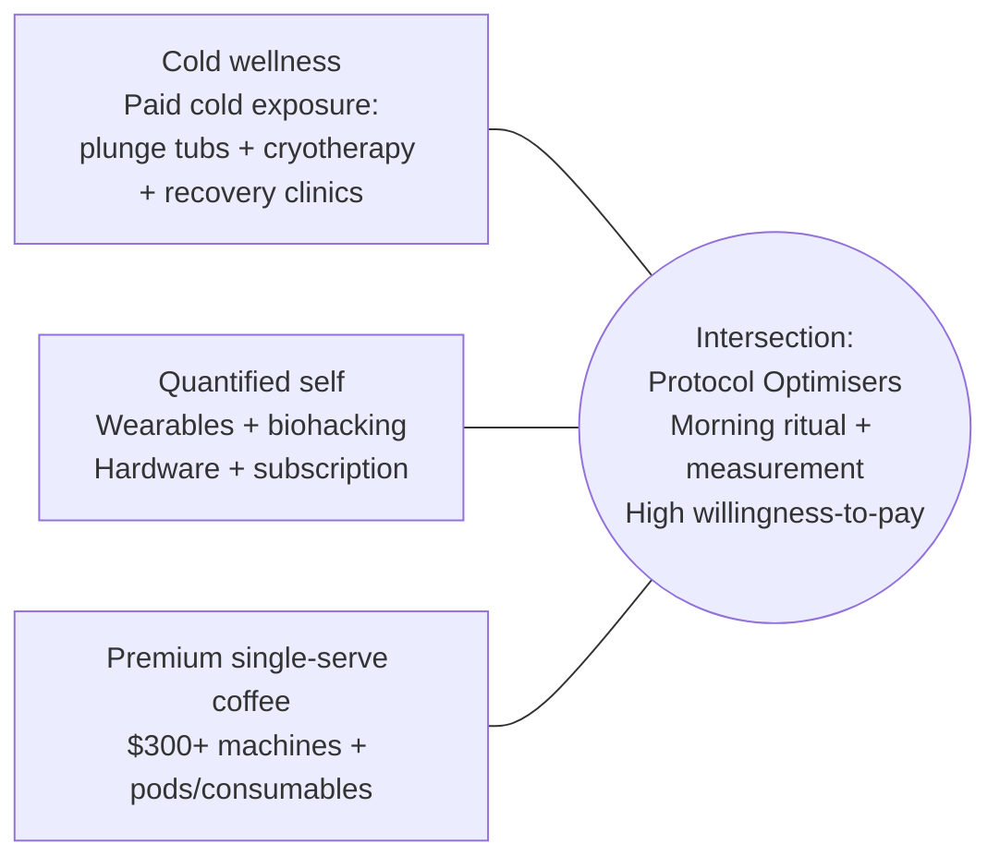

# Brezi Market Sizing and Validation Report

## Executive summary

Brezi’s “cold as a deliberate physiological practice” pivot targets a *measurable* intersection: (1) consumers who pay for cold exposure (tubs, cryotherapy, recovery clinics), (2) quantified‑self users comfortable with hardware + subscription, and (3) premium at‑home single‑serve coffee buyers (machines + recurring pods/consumables). The hard constraint on near‑term *intersection* size is the monetised cold‑wellness market (hundreds of millions to low single‑digit billions, depending on whether you count only wellness modalities or also clinical cryotherapy devices). The upside is that the *adjacent recurring consumables* markets (coffee pods; paid memberships) are structurally large and proven, which supports Brezi’s planned cartridge subscription economics. citeturn0search1turn0search2turn6search2turn5search22

Key sizing takeaways:

- **Cold wellness (ice baths/cold plunges/cryotherapy)**  
  - **At‑home device** (tight scope): cold plunge tubs are estimated at **~USD 331m (2024)**, growing **~8.1% CAGR** to the early 2030s. citeturn0search1  
  - **Cryotherapy (wellness + medical) – narrow market**: **~USD 208m (2024)** with **~7.8% CAGR** to 2030 (and multiple alternative estimates around 200–350m depending on scope). citeturn0search2turn0search16turn0search11  
  - **Cryotherapy device market (broad device scope)**: **~USD 2.93bn (2024)** to **~USD 4.28bn (2030), ~6.5% CAGR**—*not directly comparable* to the narrower wellness cryotherapy market because it typically includes a much wider medical device set. citeturn0search8  
  **Implication:** for Brezi positioning, the “paid cold exposure” market is *real but still early*; the **device category is measurable**, while “service” is harder to size cleanly as a standalone global category from open sources, so this report triangulates using recovery‑clinic revenues and broader recovery‑services market proxies. citeturn25search1turn23search1turn19search28

- **Biohacker / quantified‑self segment (proxy sizing)**  
  - **Biohacking market**: estimates diverge by definition; one widely cited estimate places it around **USD 20.6bn (2025)** growing at **~12% CAGR** to the mid‑2030s; other definitions are materially larger. citeturn0search22turn0search6  
  - **Wearables (value)**: ~**USD 86.8bn (2025)** to **USD 231bn by the mid‑2030s (~11.6% CAGR)** (one estimate), with other credible estimates in a similar band. citeturn5search32turn5search4  
  - **Wearables (shipments)**: **~538m units in 2024 (+6.1% YoY)** (IDC forecast). citeturn5search9  
  - **Subscription attachment (key for Brezi cartridges)**: research reports **~50% of US internet households** use wearables and **~32% of wearable owners** have an attached subscription. citeturn5search22

- **Premium single‑serve coffee (USD 300+)**  
  - **Coffee machines (broad)**: ~**USD 12.4bn (2025)** growing **~4.9% CAGR** to the mid‑2030s. citeturn6search9  
  - **Capsule coffee machines (hardware only)**: **~USD 1.67bn (2024)** growing **~3.3% CAGR** to 2030. citeturn6search0  
  - **Pods consumables**: **~USD 40.5bn (2024)** growing **~6.1% CAGR** to 2030—this is the strongest analogue for Brezi’s cartridge subscription economics. citeturn6search2  
  - **Premium coffee machines (price‑positioned estimate)**: one public estimate sizes “premium coffee machines” at **~USD 5.5bn (2024)** growing **~5.6% CAGR** to 2035; treat as directional and triangulate with other category totals. citeturn14search15turn6search9

Bottom line on the overlap: using transparent, sensitivity‑driven scenarios (defined in the “Overlap” section), the *strict* intersection spend pool (coffee + paid cold exposure among quantified‑self users) plausibly sits around **~USD 0.3bn (conservative)** to **~USD 1.2bn (aggressive)** annually today, with the biggest uncertainty being *how much of pods/consumables spending can be attributed to the quantified‑self + paid‑cold cohort*. citeturn6search2turn0search1turn0search2turn5search22

## Context and definitional notes

Brezi is a entity["city","Hong Kong","sar, china"] wellness hardware startup aiming to pivot from coffee appliance to a cold‑wellness lifestyle platform (“Start Cold” / “Cold Protocol”), targeting “Protocol Optimisers” (27–38) who track biometrics and spend ~$400+ on routine‑reinforcing products (wearables integration; cartridge subscriptions; follow‑on recovery drink and adaptogen/nootropics products). This report treats that positioning brief as given and focuses on external market validation. citeturn5search22turn6search2

The target persona is often associated with creators and communities around quantified self and cold exposure (e.g., entity["known_celebrity","Andrew Huberman","neuroscientist podcaster"], entity["known_celebrity","Peter Attia","physician longevity author"], entity["known_celebrity","Wim Hof","dutch cold exposure coach"]). These references matter because they signal an audience that already believes in protocolised interventions and measurement loops, which increases plausibility for Brezi’s “biometric state × brew parameters × outcomes” moat. citeturn5search22turn20search7

A critical caution for sizing: “cold wellness” has *no single canonical total*. Some reports focus narrowly on wellness cryosaunas and plunge tubs (hundreds of millions), while others include broad clinical cryotherapy devices (billions). The numbers are not directly comparable; this report therefore enumerates **device vs service** and explicitly flags scope differences. citeturn0search2turn0search8turn0search6

## Market sizing results

### Cold wellness market

**At‑home device (tight scope, most comparable to Brezi as a consumer hardware product)**  
The most directly measured “at‑home cold wellness device” category is cold plunge tubs:

- Cold plunge tub market: **USD 330.58m (2024)** → **USD 659.86m (early 2030s)** at **~8.1% CAGR** (Grand View Research estimate). citeturn0search1  

Independent estimates vary mainly on CAGR (e.g., some place growth closer to mid‑single digits), which is consistent with a young category still stabilising its distribution and replacement cycles. citeturn25search10turn0search13

**Cryotherapy device (broad device scope, not purely wellness)**  
A separate, much larger device framing is “cryotherapy devices” (often including clinical devices and non‑wellness segments):

- Cryotherapy device market: **USD 2.93bn (2024)** → **USD 4.28bn (2030)** at **~6.52% CAGR** (ResearchandMarkets summary). citeturn0search8  

This category likely overstates the *wellness‑first* portion relevant to Brezi, but it is useful as an outer bound for “cold tech device spend.” citeturn0search8turn0search6

**Service (spa/clinic) sizing—triangulated, with explicit uncertainty**  
A clean global estimate for “cryotherapy sessions + plunge studios” as a standalone service category is not consistently available in open, primary sources. What is available:

- Narrow “cryotherapy market” estimates (often spanning devices + services and/or wellness + clinical) cluster around **USD ~200–350m in 2024**, growing mid‑ to high‑single digits depending on methodology. citeturn0search2turn0search16turn0search11  
- Recovery clinics’ reported revenues provide a reality check. For example, Restore reported **USD 135m system‑wide sales (2022)**; an industry article later reported **~USD 200m annual sales (2024)** (methodology not fully transparent, but directionally consistent with continued unit growth). citeturn25search1turn23search1  
- Broader “fitness recovery services” market estimates (which include cryotherapy, compression, IV, red light, etc.) suggest multi‑billion‑dollar service spending, implying cold therapies are *one component* of a much larger optimisation services economy. Example: one estimate sizes fitness recovery services at **USD ~8.3bn (2025)** with strong growth into the 2030s. citeturn19search28  

**Working “cold wellness” roll‑up (explicit scope):**
- **Narrow monetised total (device + narrow cryotherapy):** cold plunge tubs (330.6m) + cryotherapy (~207.5m) ≈ **USD ~0.54bn in 2024**. citeturn0search1turn0search2  
- **Broader device‑inclusive framing:** cold plunge tubs (330.6m) + cryotherapy devices (2.93bn) ≈ **USD ~3.26bn in 2024**, but this includes clinical device categories beyond wellness. citeturn0search1turn0search8  
- **Service spend remains the largest uncertainty** because many services are bundled into broader recovery markets (multi‑modality memberships). This uncertainty is explicitly carried into the overlap scenarios. citeturn19search28turn23search1

### Biohacker / quantified‑self segment

This report sizes the segment using three proxies: “biohacking market” estimates, wearables market value, and wearables unit shipments + subscription attachment.

- Biohacking market: one estimate **USD 20.58bn (2025)** → **USD 56.31bn (mid‑2030s)** at **~12.14% CAGR** (Fortune Business Insights). citeturn0search22  
  Another estimate gives materially higher totals (definition likely broader), demonstrating that “biohacking” is not a stable taxonomy across vendors. citeturn0search6  

- Wearables market (value): **USD 86.78bn (2025)** → **USD 231.43bn (mid‑2030s)** at **~11.6% CAGR** (Fortune Business Insights). citeturn5search32  
  A second estimate places wearables at **USD 92.9bn (2025)** with similar long‑term growth. citeturn5search4  

- Wearables shipments: entity["organization","International Data Corporation","market research firm"] forecasts **~537.9m wearable shipments in 2024 (+6.1% YoY)**. citeturn5search9  

- Subscription attachment: entity["organization","Parks Associates","consumer research firm"] reports **nearly 50% of US internet households own and actively use wearables**, and **32% of wearable owners have a subscription** attached. citeturn5search22  

**Interpretation for Brezi:** wearables and subscription‑attached behaviour are already mainstream in affluent markets, so Brezi’s proposed “hardware + app + subscription” posture matches established consumer payment patterns (particularly relevant for cartridges). citeturn5search22turn6search2

### Premium single‑serve coffee appliances (USD 300+) and consumables

Market sizing is separated into: (i) appliances overall, (ii) capsule machine subcategory, (iii) premium segment estimates, and (iv) pods (consumables).

- Coffee machines (all types): **USD 12.41bn (2025)** → **USD 19.06bn (mid‑2030s)** at **~4.88% CAGR**. citeturn6search9  
- Capsule coffee machines (hardware): **USD 1.67bn (2024)** → **USD 2.23bn (2030)** at **~3.3% CAGR**; Europe is cited as a leading region in this segment. citeturn6search0  
- Premium coffee machines (price‑positioned estimate): **USD 5.52bn (2024)** → **USD 10bn (mid‑2030s)** at **~5.6% CAGR** (directional). citeturn14search15  
- Coffee pods (consumables): **USD 40.49bn (2024)** → **USD 58.19bn (2030)** at **~6.1% CAGR**—a powerful analogue to cartridge subscription scale. citeturn6search2  

Demand reality check (daily frequency, relevant to Brezi’s “morning protocol” framing): entity["organization","National Coffee Association","us coffee trade group"] reports **66% of American adults drink coffee daily**, averaging **~3 cups/day**. citeturn20search0

## Key players and revenue comparables

### Company revenue and model comparison table

Notes:
- “Latest revenue / best public estimate” uses *primary filings/press releases where available*; private-company numbers are labelled as “reported” or “estimate.”  
- Where a company is part of a larger group, the most relevant segment metric is used (e.g., Nespresso segment sales). citeturn24view0turn7search1turn7search13turn21view0turn25search0turn25search1turn15search17turn15search4

| Company | Business model (hardware / subscription / consumables / services) | Latest revenue metric (year) | Notes on metric scope | Source |
|---|---|---:|---|---|
| entity["company","Nestlé","food and beverage company"] | FMCG + beverages; owns multiple coffee systems | CHF 89,490m total sales (2025) | Group total; coffee is a major category inside group | citeturn24view0 |
| entity["company","Nespresso","coffee capsule brand"] | Hardware + consumables (pods) + DTC retail | CHF 6,481m segment sales (2025) | Segment sales reported separately in Nestlé results | citeturn24view0 |
| entity["company","Keurig Dr Pepper","beverage company"] | Hardware (brewers) + consumables (pods) + beverages | USD 16.6bn net sales (2025); USD 4.0bn US Coffee segment | US Coffee includes K‑Cup pods and brewer sales | citeturn7search1 |
| entity["company","De'Longhi","italian appliance maker"] | Appliances (espresso; consumer + pro) | €3,801.5m revenues (2025) | Preliminary full‑year revenues | citeturn7search13 |
| entity["company","Breville Group","appliance maker australia"] | Appliances; mix of coffee + kitchen | A$1,696.6m revenue (FY25) | Company presentation/announcement includes revenue table | citeturn21view0 |
| entity["company","Plunge","cold plunge company"] | Cold‑plunge hardware (consumer) | USD 100m revenue (reported for 2024) | Media‑reported milestone; private company | citeturn25search0turn25search28 |
| entity["company","Restore Hyper Wellness","wellness franchise"] | Services (recovery modalities) + memberships | USD 135m system‑wide sales (2022); ~USD 200m annual sales (reported for 2024) | 2022 is company press; 2024 is industry reporting | citeturn25search1turn23search1 |
| entity["company","Oura","smart ring maker"] | Hardware + subscription (membership software) | >USD 500m revenue (2024); ~USD 1bn sales target (2025) | Company press statement; private company | citeturn15search17 |
| entity["company","WHOOP","wearable subscription"] | Subscription with included device | Revenue not consistently disclosed; public estimates suggest “>$260m” | Private-company estimates; treat as uncertain | citeturn15search4turn15search19 |
| entity["company","MECOTEC","cryotherapy chamber maker"] | B2B hardware (cryo chambers) | YoY revenue growth “>25%” (2023) | No absolute revenue disclosed | citeturn19search13turn1search15 |

## Overlap analysis and TAM/SAM/SOM scenarios

### Visual: overlap logic (Mermaid)

### Assumptions and uncertainties

Because no public dataset directly measures “people who (a) pay for cold exposure, (b) use wearables, and (c) own premium single‑serve coffee systems,” the overlap estimate must be scenario‑based.

This report defines the “intersection opportunity” as **annual spending on (i) paid cold exposure + (ii) premium single‑serve coffee systems (machines + pods)** by **quantified‑self consumers** (wearables users). Wearables market value is *not* counted in the TAM because it is not directly monetised by Brezi, but wearables adoption and subscription attachment are used to justify the behavioural feasibility of a cartridge subscription model. citeturn5search22turn6search2

**Hard inputs used (anchored to sources):**
- Cold plunge tubs: USD 330.6m (2024). citeturn0search1  
- Cryotherapy (narrow): USD 207.5m (2024). citeturn0search2  
- Pods consumables: USD 40.49bn (2024). citeturn6search2  
- Premium coffee machines estimate: USD 5.52bn (2024) (directional). citeturn14search15  
- Subscription readiness: 32% of wearable owners have a subscription (US). citeturn5search22  

**Key uncertain parameters (scenario sensitivities):**
1) Share of pods/consumables spend attributable to quantified‑self consumers (proxy for “Protocol Optimisers”).  
2) Share of quantified‑self premium coffee consumers who also pay for cold exposure (cold plunge tubs, cryotherapy or recovery clinic memberships).  
3) Geographic concentration (how much of this spend is in Brezi’s addressable launch markets).  
4) Brezi execution factors (CAC in this niche, retention on subscription, attachment rate of cartridges to hardware).  

### Scenario model

**Step 1: define “paid cold exposure” baseline (narrow)**  
Paid “cold wellness” baseline (narrow) = cold plunge tubs (330.6m) + cryotherapy (207.5m) = **USD 538.1m (2024)**. citeturn0search1turn0search2

**Step 2: estimate coffee spend inside the intersection cohort**  
Coffee portion considered = premium coffee machines + pods. These are very large markets; only a small fraction is assumed to be within the quantified‑self + paid‑cold cohort. citeturn6search2turn14search15

**Scenario parameterisation (explicit):**
- % of pods spend by quantified‑self consumers: **1% / 2% / 3%** (conservative/base/aggressive)  
- % of premium coffee machines spend by quantified‑self consumers: **2% / 3.5% / 5%**  
- Conversion from quantified‑self coffee consumers to “also pays for cold exposure”: **30% / 45% / 60%**  
- Share of paid cold exposure spend attributable to this cohort: **30% / 45% / 60%**  

These percentages are assumptions (not observed facts) and should be stress‑tested via Brezi’s validation plan. citeturn5search22turn20search7

### Scenario chart (TAM / SAM / SOM)

Definitions:
- **TAM (intersection)**: global annual spend on paid cold exposure + premium single‑serve coffee systems (machines + pods) by the quantified‑self + paid‑cold cohort.  
- **SAM**: portion of TAM in “early Brezi launchable” developed markets (assumed 65% of TAM; sensitivity driver).  
- **SOM**: portion Brezi could realistically capture within 3–5 years (assumed 1% / 3% / 6% of SAM).  

| Scenario | TAM (USD) | SAM (65% of TAM) | SOM (capture of SAM) | Notes |
|---|---:|---:|---:|---|
| Conservative | ~315m | ~205m | ~2.1m (1%) | Pods share 1%, cold overlap 30% |
| Base | ~694m | ~451m | ~13.5m (3%) | Pods share 2%, cold overlap 45% |
| Aggressive | ~1.215bn | ~790m | ~47.4m (6%) | Pods share 3%, cold overlap 60% |

**How TAM is formed (illustrative):**  
TAM ≈ (pods market × pods share × cold overlap) + (premium machines × machines share × cold overlap) + (paid cold exposure baseline × cold cohort share). citeturn6search2turn14search15turn0search1turn0search2

**Interpretation:** the model says the *intersection spending pool* is plausibly **hundreds of millions to low billions** annually, with the dominant uncertainty being what fraction of the enormous pods market sits inside a quantified‑self + paid‑cold cohort. The model intentionally excludes broader supplement/nootropics markets; if BreziRest Pod and BreziBar are included, the long‑term wallet could be larger but would require separate sizing. citeturn6search2turn0search1turn5search22

## Validation plan for Brezi

This is a practical validation plan to confirm **demand** and **willingness‑to‑pay** among Protocol Optimisers (27–38; wearables; ~$400+ threshold), and to de‑risk unit economics for “hardware + cartridge subscription + wearable integrations.” It is structured to generate *quantitative* answers quickly.

### Demand and WTP measurement

1) **Segmented survey with forced trade‑offs**  
Run a survey targeting verified wearables users (Oura/WHOOP/Apple Watch communities, relevant paid newsletters, fitness event audiences). Use:
- Van Westendorp price sensitivity (hardware; subscription)  
- Conjoint / discrete choice: “cold protocol coffee” vs “best‑tasting cold brew” vs “cheapest cold brew” vs “fastest hot coffee”  
- Protocol framing tests: “Start Cold” vs “recovery coffee” vs “bio‑coffee”  
Primary output: conversion‑quality demand curves at $399/$499/$599 and cartridge subscriptions at $X/week. Use wearables subscription attachment as an external benchmark for subscription acceptance. citeturn5search22

2) **Pilot cohorts with wearable‑linked feedback loops (measured outcomes)**  
Recruit 200–500 users who already track sleep/HRV and coffee intake. Provide a “beta cold protocol kit” (device or simulated hardware + standardised brew + cartridge pack). Track:
- “brew moment state” (sleep score / readiness / HRV proxy)  
- subjective outcomes (focus, calm, GI comfort, training readiness)  
- retention and weekly reorder behaviour  
This directly tests the core moat hypothesis (biometrics × brew parameters × outcomes), which is the point of differentiation versus established pod systems. citeturn15search17turn5search22

3) **Pricing experiments tied to subscription attachment**  
Use a two‑part offer test:
- Hardware price reduction vs subscription discount (e.g., “$100 off machine” vs “first month free cartridges”).  
Given pods are the main profit pool in single‑serve systems, optimising for *subscription attachment* is usually higher leverage than maximising one‑time hardware margin. citeturn6search2turn24view0turn7search1

### Unit economics validation for hardware + cartridges

4) **Cartridge gross margin and COGS stability testing**  
Build a unit economics sheet with:
- landed cartridge COGS (materials + manufacturing + fulfilment)  
- spoilage/returns  
- payment fees  
- contribution margin per month at 2/4/6 servings per week  
Benchmark against the fact that pods are structurally a large market and are typically the primary profit driver in single‑serve ecosystems. citeturn6search2turn24view0

5) **Churn / retention experiments aligned to habit frequency**  
Coffee is daily for many consumers (US daily incidence 66%); that enables habit loops, but only if the product is frictionless and reliable. Track:
- time‑to‑second‑order  
- reorder cadence  
- effect of “protocol reminders” and “wearable‑based prompts”  
The goal is to identify the minimum viable subscription that feels like a “protocol” rather than a “grocery delivery.” citeturn20search0turn5search22

### Wearable integration validation

6) **A/B tests: “data‑aware brewing” vs “static brew presets”**  
Even if early Brezi does not fully automate “state‑based brewing,” test whether showing users their current state (sleep/recovery proxy) *changes brew choice and satisfaction*.  
Outcome: does wearable integration *increase* subscription retention or WTP, and by how much (measured)? Use existing evidence that subscription attachment already exists in wearables to set expectations and avoid over‑engineering. citeturn5search22turn15search17

## Strategic implications for Brezi

### Go‑to‑market priorities

The strongest early positioning is to treat Brezi as a **premium morning protocol system** that combines:
- a daily consumable ritual (coffee; pods/cartridges economics are proven at scale), citeturn6search2turn20search0  
- an identity‑rich differentiator (cold protocol / cold exposure movement), and citeturn20search7turn0search1  
- an “outcomes loop” compatible with quantified‑self behaviour (wearables + subscriptions are normalised). citeturn5search22turn15search17  

Launch sequencing implication: lead with **PrecisionBrew + cartridges** as the wedge; use data + habit loops to justify BreziRest and BreziBar later, rather than relying on broad “wellness beverage” positioning from day one.

### Pricing and subscription model

The market structure suggests:
- Premium coffee is already a **hardware + consumables** business (Nespresso and Keurig economics demonstrate that the installed base supports recurring consumables at massive scale). citeturn24view0turn7search1turn6search2  
- Therefore, Brezi should optimise for:
  1) cartridge attachment rate,  
  2) retention,  
  3) gross margin per active subscriber,  
  ahead of “maximising hardware margin.”  

A plausible pricing architecture to validate (not a recommendation without testing):  
- Hardware near the buyer’s stated ~$400 threshold (to minimise adoption friction), combined with  
- a subscription structured as “protocol packs” (weekly cadence) rather than generic replenishment, leveraging the 32% wearable subscription attachment benchmark as behavioural support. citeturn5search22turn6search2

### Partnerships

Partnership logic should follow where the overlap already has proven monetisation:
- **Wearables platforms and communities** (for acquisition and integration credibility): Oura scale signals a large paying cohort in this behaviour set. citeturn15search17  
- **Cold wellness hardware and service brands** (co‑marketing; cross‑sell): Plunge and Restore demonstrate meaningful revenue pools and membership models. citeturn25search0turn25search1  
- **Premium coffee ecosystems** (distribution and consumables lessons): large incumbents validate system and subscription mechanics; Brezi should differentiate by outcome‑linked cold protocol, not by competing on pod compatibility. citeturn24view0turn7search1turn6search2  

### Data moat exploitation

Brezi’s stated moat—biometric state at brew moment + brew parameters + subjective performance outcomes—fits the quantified‑self market’s directionality: companies that combine sensor‑derived “state” with behavioural recommendations and subscription models are scaling quickly (Oura revenue trajectory demonstrates market readiness). citeturn15search17turn5search22

The strategic challenge will be to ensure:
- the data loop produces *actionable* insights (not dashboards), and  
- the protocol framing remains credible (avoid health claims not supported by evidence), especially when tying cold exposure and coffee to physiological outcomes.

## Explicit list of assumptions and uncertainties

1) The “premium coffee machines” market estimate used for scenario modelling is a directional third‑party estimate; it is triangulated against broader coffee machine totals and capsule machine sizing. citeturn14search15turn6search9turn6search0  
2) The “paid cold exposure services” market is not cleanly separated in open primary sources; this report uses narrow cryotherapy market estimates plus recovery‑clinic revenue disclosures and broader recovery‑services market proxies, and treats service sizing as a key uncertainty. citeturn0search2turn25search1turn19search28  
3) WHOOP revenue is not consistently disclosed in filings; public estimates are treated as uncertain. citeturn15search4turn15search19  
4) TAM/SAM/SOM scenarios are *assumption‑driven* by design; the most sensitive parameter is the fraction of pods/consumables spend attributable to the quantified‑self + paid‑cold cohort. citeturn6search2turn5search22  
5) Geographic SAM share (65%) and SOM capture rates (1%/3%/6%) are placeholders for planning; they must be replaced by measured CAC, conversion, and retention once pilot data exists. citeturn5search22turn20search0