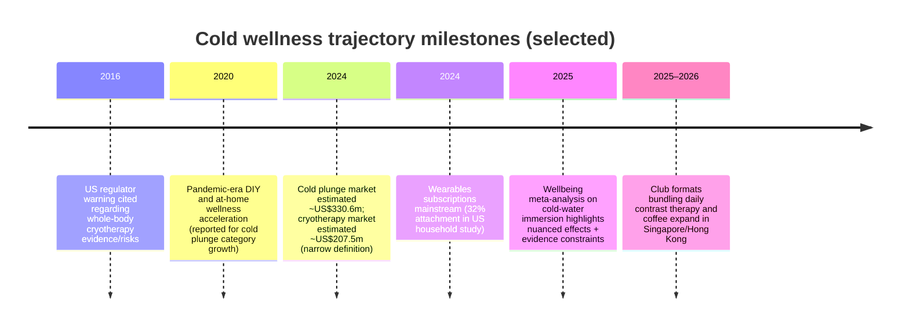

# Cold Wellness Trend Trajectory and Implications for Brezi

## Executive summary

Cold exposure is moving from an athlete/recovery niche into a broader consumer wellness behaviour, but it is doing so unevenly across modalities. The clearest “paid adoption” signals are in (a) high-ticket **cold plunge hardware**, and (b) **recovery/cryotherapy services** with membership models. Public market-report summaries estimate the global cold plunge tub market at **US$330.58m (2024)**, projecting **US$659.86m by 2033** at **~8.1% CAGR (2025–2033)**. citeturn0search0turn1search1 The same publisher’s cryotherapy market summary estimates **US$207.5m (2024)**, reaching **US$325.3m by 2030** at **~7.8% CAGR (2025–2030)**. citeturn0search1 Other trackers size cryotherapy larger (for example **US$347.9m in 2024** by one estimate), reflecting definitional differences (clinical cryotherapy vs wellness cryosaunas/spas); treat these as overlapping but not identical scopes. citeturn0search6turn0search1

Within cold plunge hardware, the “centre of gravity” is currently commercial (gyms, studios, sports facilities): one press-summary reports **commercial applications at 81.3% share in 2024**, while “residential” demand is forecast to grow (e.g., **~7.4% CAGR** in an outlook statement). citeturn1search5 That pattern (commercial lead, residential catch-up) is consistent with a trend transitioning from occasional/experience-based usage to habit formation at home—important for Brezi’s “Cold Protocol” thesis.

Demographically, early adoption aligns with the same structural profile as the Protocol Optimiser: affluent, educated, urban, wellness-instrumented consumers. In a large US survey study of wearable ownership (2020–2022 data), higher annual income (≥US$200k) and advanced degrees both strongly predict wearable ownership (OR ~2.27 and ~2.23), and ownership is much higher in urban areas than rural. citeturn11search4turn11search0 This matters because cold wellness “durability” is increasingly tied to the **wearables + subscription** ecosystem: a large consumer study reports that **32% of wearable owners have an attached subscription** and that **92% of wearable purchase intenders** would pay more for at least one health-related feature. citeturn1search4

On durability, evidence supports modest and context-dependent benefits (especially in sport recovery), but also meaningful risks and constraints. A meta-analysis synthesis in sport contexts finds cold-water immersion (CWI) can reduce delayed-onset muscle soreness and improve perceived recovery, but outcomes can vary by protocol and context. citeturn1search15turn1search7 A broader wellbeing-focused systematic review concludes the evidence base is still constrained (few RCTs, small samples), and effects can be time-dependent. citeturn11search7 Safety risks (cold shock, cardiovascular strain, drowning risk in open water) are repeatedly emphasised by safety authorities, and the clinical evidence for whole-body cryotherapy spa claims has been publicly questioned; for example, a state government summary notes the US regulator warned in 2016 that whole-body cryotherapy is a trend with limited evidence and potential risks. citeturn1search18turn8search1turn8search7

Strategically for entity["company","Brezi","hong kong wellness startup"]—a entity["city","Hong Kong","sar china"] startup repositioning PrecisionBrew into a “Cold Protocol” platform—the near-term opportunity is to ride the **commercial-to-residential transition** and the **membership mindset** by anchoring cold wellness in a *daily morning ritual* that is already widely adopted (coffee) and then instrumenting it with wearables-linked data capture. The highest-leverage actions are: focus on markets where cold wellness infrastructure is mature (US/UK/AU) and where “club” formats are emerging (Singapore/HK), partner with existing cold exposure venues that already bundle café/coffee, and prioritise data capture that is credible, non-medical-claim, and repeatable.

## Growth trajectory and adoption signals

Cold wellness is best treated as a cluster of related behaviours with different monetisation structures: **(i) at-home devices** (plunge tubs, chillers), **(ii) services/clinics** (cryotherapy spas, recovery studios, contrast therapy clubs), and **(iii) “free behaviours”** (cold showers, cold-water swimming) that may drive awareness but do not directly show up in paid market sizing.

### At-home device trajectory

The most consistently reported “consumer device” market proxy is cold plunge tubs. entity["company","Grand View Research","market research firm"] estimates the global cold plunge tub market at **US$330.58m in 2024**, projecting **US$659.86m by 2033** at **~8.1% CAGR (2025–2033)**, with demand framed around inflammation, discomfort, and muscle soreness among athletes and sports training contexts. citeturn0search0turn1search1

A key adoption signal in the same publisher’s press highlights is *where usage is happening now vs where it is heading next*: commercial applications are cited as holding **81.3% share in 2024**, while residential growth is explicitly described as rising because wellness is shifting “from an occasional activity to a daily lifestyle priority.” citeturn1search5 This is a classic “trajectory marker” for durable consumer behaviours: when commercial (experience) dominates early and home (habit) grows later, the trend typically has legs if the home form becomes reliable and low-friction.

### Service and clinic trajectory

Service-side cold wellness is harder to isolate because “cryotherapy” is frequently defined differently across vendors (clinical devices, dermatology/oncology uses, sports recovery, beauty/wellness spas). In one narrow market summary (often read as “wellness cryotherapy + some clinical”), the same publisher estimates **US$207.5m (2024)** growing to **US$325.3m by 2030** at **~7.8% CAGR**, and notes North America as the largest revenue region in 2024. citeturn0search1 A competing estimate places cryotherapy at **US$347.9m (2024)** growing to **US$550.7m by 2033** at **~5.2% CAGR**, implying a broader scope. citeturn0search6turn0search10

For services, the most concrete validation comes from operator scale. entity["company","Restore Hyper Wellness","recovery clinics us"] reported **US$135m system-wide sales in 2022**, expanding to **186 locations** and delivering **2.2m services** (including cryotherapy), indicating substantial repeat usage in a membership-like services model. citeturn2search11 An industry report later described 2024 scale as **57,000+ members**, **2.9m therapies**, and **~US$200m annual sales** (reported; not a public filing). citeturn2search3

In parallel, new “contrast therapy club” formats explicitly position cold exposure as a **regular practice**. entity["organization","The Ice Bath Club","contrast therapy clubs"] markets “daily recovery” and lists multiple “open now” locations in entity["city","Singapore","city-state"] and Hong Kong, with planned expansion in other Asian cities. citeturn8search8 This service format is strategically important for Brezi because it normalises cold exposure as a repeatable routine (not a one-off dare), and it creates real-world surfaces for partnerships and sampling.

### Cold showers and cold-water swimming as “free adoption” signals

Cold showers are a behaviour trend with weaker market sizing (because it is not primarily monetised), but there is evidence it can become a repeated habit under a “protocol” frame. A randomised trial on hot-to-cold showering reported high completion of a 30-day protocol (79%), and that **64% continued** the practice on a regular basis afterward. citeturn11search2 That does not prove broad adoption, but it does show habit persistence is credible once users commit to a structured protocol.

Cold-water swimming in the UK is a visible “mainstreaming” signal and also a safety/reputational risk factor; secondary reporting citing Sport England data suggests open-water swimming participation increased (for example, an estimate of **408,000** people participating at least twice in a 28-day period, described as an **18%** increase vs the previous year in one period). This is not a perfect proxy for cold exposure “protocols,” but it is a directional adoption signal. citeturn3search9

image_group{"layout":"carousel","aspect_ratio":"16:9","query":["at home cold plunge tub in backyard","whole body cryotherapy chamber spa","contrast therapy sauna cold plunge club coffee","cold shower morning routine"],"num_per_query":1}

### Notes on paywalls and triangulation

The full reports from entity["company","Grand View Research","market research firm"], entity["company","IMARC Group","market research firm"], and entity["company","Research and Markets","market research publisher"] are typically paywalled; this report relied on their publicly accessible market-summary pages and press highlights for top-line figures. citeturn0search0turn0search6turn0search3 Where alternative estimates exist, they are shown as definitional variance rather than “error.”

## Who is adopting and why

Cold wellness early adopters can be profiled using two robust proxies: (1) where market reports say demand originates (athletes/sports facilities), and (2) the demographics of *wearable ownership* (as a marker of measurement-driven, subscription-tolerant consumers).

### Early adopter profile

Market summaries directly describe sports/athlete demand as a central driver of cold plunge product adoption (muscle soreness, inflammation, sports training facilities). citeturn1search1turn0search4 The same is directionally consistent with the services side: recovery studios position cold exposure as a performance/recovery modality among active consumers, and services operators cite cryotherapy as a major delivered service. citeturn2search11turn2search3

Wearable adoption research provides a strong demographic analogue for the Protocol Optimiser persona. In a US survey study (N≈24k), higher annual income (≥US$200k) and advanced degrees were strong predictors of wearable ownership (OR ~2.27 and ~2.23), and ownership was much higher among urban residents. citeturn11search4turn11search0 More broadly, Rock Health’s analysis of wearables adoption notes younger, more affluent, highly educated, and urban consumers report higher wearable ownership. citeturn11search1

Because the Brezi thesis relies on “biometric state at the brew moment,” it matters that this cohort is already comfortable with paid “measurement rails.” Parks Associates’ consumer study reports **32%** of wearable owners have an attached subscription and **92%** of wearable purchase intenders would pay extra for health-related features. citeturn1search4turn1search8

### Mainstreaming dynamics

Mainstream adoption appears to be driven less by elite performance and more by “daily wellbeing” narratives. Several sources point to broad consumer interest alongside caution about overclaiming. A wellbeing-focused systematic review and meta-analysis notes CWI has gained popularity among the general population and reports potential time-dependent effects on stress and sleep quality, while also emphasising limits in the evidence base (few RCTs, small sample sizes, limited diversity). citeturn11search7turn3search15 University-based commentary in Australia describes ice baths as “booming in popularity” while placing strong emphasis on health risks and the mismatch between social media claims and evidence. citeturn3search3

A useful sub-signal of mainstreaming is the rise of “club formats” that frame contrast therapy as an everyday routine—language that matches the commercial-to-residential shift described in cold plunge market commentary. citeturn1search5turn8search8

## Geographic hotspots and context notes

The goal here is not to assert perfect market-size rankings (public country-level adoption data is uneven), but to rank “leading” markets by a combination of (i) market-report regional signals, (ii) presence of scaled operators or club formats, and (iii) cultural/regulatory context.

### Leading markets ranking

| Market | Readiness signal | Adoption proxy | Context and regulatory notes |
|---|---|---|---|
| entity["country","United States","country"] | Largest revenue region for cryotherapy in one market summary; also home to multiple scaled operators | North America cited as largest cryotherapy region in 2024; large-scale recovery franchises and hardware brands originate here citeturn0search1turn2search11turn2search2 | Whole-body cryotherapy spa claims have drawn regulatory caution (2016 warning cited in an official state summary), and cold shock risks are emphasised by weather/safety authorities citeturn1search18turn8search1 |
| entity["country","United Kingdom","country"] | Strong behavioural signal in cold-water swimming culture and participation; high media salience | Secondary reporting citing Sport England suggests open-water swimming participation increased in a prior period (directional mainstreaming) citeturn3search9 | Safety messaging is prominent: cold shock and cardiovascular strain emphasised by UK charities and safety organisations citeturn8search11turn8search7 |
| entity["country","Australia","country"] | High cultural fit (outdoor water culture) and increasing academic/public commentary | University-based analysis describes rising ice-bath popularity and risks; major national water-safety bodies publish cold-water survival guidance citeturn3search3turn8search17 | Regulatory context is mostly around safety guidance rather than product approvals; messaging must strongly manage risk framing citeturn8search17 |
| entity["city","Singapore","city-state"] | Emerging club infrastructure; urban, high-disposable-income, protocol culture | Multiple contrast therapy clubs list openings in Singapore; lifestyle media highlights multiple venues (proxy for “availability”) citeturn8search8turn8search15 | Tropical climate means most cold exposure is engineered (chillers/managed venues), which can increase willingness to pay but also raises operational reliability requirements (inference) |
| Hong Kong | Emerging club infrastructure; dense urban market | A contrast therapy club lists a Hong Kong location “open now” (availability proxy) citeturn8search8 | Similar to Singapore (engineered cold exposure); local medical/consumer regulations specific to spa/therapy devices are not consistently summarised in open sources (unspecified) |

Two nuance points are important for strategic planning. First, Asia-Pacific growth may be faster from a smaller base: a regional summary estimates Asia-Pacific cryotherapy revenue at **US$29.9m (2024)** with a forecast **~10.4% CAGR (2025–2030)**, signalling “early growth” conditions even if absolute size is lower. citeturn0search16 Second, local-service formats bundling coffee and cold exposure exist in both Western and Asian contexts (see Ecosystem section), which is unusually aligned with Brezi’s “morning ritual” wedge. citeturn9search2turn8search8

## Ecosystem catalysts driving growth

Cold wellness adoption is being driven by three reinforcing loops: (1) premium hardware brands and DIY communities lowering barriers to “at-home”, (2) service operators turning cold exposure into a repeatable habit with memberships, and (3) influencers/podcasts normalising cold exposure as part of a broader performance/longevity protocol.

### Ecosystem table of brands, influencers and communities

| Actor | Role in the ecosystem | Public metric / signal | Why it matters for trajectory |
|---|---|---|---|
| entity["company","Plunge","cold plunge brand us"] | At-home cold exposure hardware at scale | Reported **US$100m annual revenue** (2024) in business media citeturn2search2turn2search16 | Validates revenue-level consumer demand for branded plunge hardware; also shows rapid scaling from the pandemic period (reported) citeturn2search13 |
| entity["company","Morozko Forge","ice bath maker us"] | Premium ice-making plunge hardware | Publicly listed high-tier pricing (e.g., models around US$11,990+ on site pages) citeturn1search17 | Demonstrates premium willingness-to-pay in the category; important for “durability among affluent optimisers” thesis |
| entity["company","Penguin Chillers","cold therapy chiller maker"] | “Build-your-own” enabling infrastructure (chillers) | Active productisation of cold therapy chillers for tubs citeturn7search15 | Supports the DIY/enthusiast segment and enables tropical-market engineered cold exposure |
| entity["company","Restore Hyper Wellness","recovery clinics us"] | Services and membership-driven adoption | System-wide sales **US$135m (2022)**, 186 locations; later industry report cites **57k+ members, 2.9m therapies, ~US$200m sales (2024)** (reported) citeturn2search11turn2search3 | Indicates repeat usage and mainstreaming via memberships; also provides partnership surfaces and consumer education contexts |
| entity["local_business","Cold Plunge Coffee","Salt Lake City, UT, US"] | Direct bridge: contrast therapy + coffee under one roof | Markets memberships including “Dip and Drip Pro with daily coffee” and “unlimited plunge + sauna access” citeturn9search2turn9search15 | Proof that “cold exposure + morning consumption” can be packaged as a single ritual product (still niche, but structurally aligned with Brezi’s positioning) |
| entity["organization","The Ice Bath Club","contrast therapy clubs"] | Contrast-therapy club format expanding in Asia | Lists multiple open locations in Singapore and Hong Kong; explicitly positions “regular practice” and includes coffee in the experience description citeturn8search8 | Strong signal of habit-format mainstreaming in dense urban markets that match Brezi’s target persona |
| entity["people","Wim Hof","cold exposure advocate"] | Mass cultural diffusion of cold exposure narrative | Instagram shows **~4M followers** (platform-visible metric) citeturn6search2 | Scale of influence; normalises cold exposure beyond elite sport; fuels top-of-funnel adoption |
| entity["podcast","Huberman Lab","health podcast"] | Protocol popularisation among biohacker-athlete consumers | Site references “Join 1M+ subscribers” and publishes cold-exposure protocol content citeturn6search9turn6search6 | Converts cold exposure from “trend” into repeatable practice language; builds trust via scientific framing |
| entity["podcast","The Peter Attia Drive","longevity podcast"] | Longevity-performance cohort shaping | “Over 100 million downloads” on official site citeturn7search0turn7search3 | Anchors cold exposure within broader “longevity optimisation” framing, expanding perceived legitimacy |
| Reddit cold plunge communities | Peer learning, product reliability signals, DIY adoption | Active discussion topics include DIY builds, equipment failures, session timing and safety concerns (qualitative) citeturn4view0turn8search4 | Community sentiment can accelerate adoption but also surfaces reliability failures and safety debates—important for Brezi positioning and partnership vetting |

## Durability assessment

The durability question is not “will cold exposure disappear?” but “what fraction becomes routine vs occasional, and which monetisation models persist?” The evidence points to a hybrid outcome: strong persistence in the Protocol Optimiser segment and in membership/service contexts, while the broader public will show more episodic uptake driven by content waves and seasonal behaviour.

### What supports durability

1. **Commercial dominance with residential catch-up** is a common pattern for durable behaviours that begin as facilitated experiences and then move into the home once products become reliable and routine-friendly. Commercial application taking a very large share in 2024 while residential is forecast to grow supports the “early-but-sticking” hypothesis. citeturn1search5turn0search0

2. **Membership-based service operators show repeat usage** at meaningful scale. Restore’s system-wide sales and delivered service volumes indicate sustained consumer demand well beyond one-time novelty. citeturn2search11turn2search3

3. **Protocol media embeds cold exposure into broader wellness systems** (sleep, recovery, resilience), which increases cultural stickiness. Huberman’s publications explicitly include cold exposure within a larger daily toolset, and similar longevity ecosystems normalise it as one lever among many. citeturn6search11turn6search9turn7search6

4. **Clinical literature offers some support for specific outcomes, especially in sport recovery**, which can stabilise adoption even if broader “miracle claims” fade. A meta-analysis in sport contexts found cold-water immersion was superior to other recovery methods for muscle soreness recovery, while effects on power/flexibility are comparable to other methods. citeturn1search15 A more general-population systematic review suggests potential time-dependent benefits on stress, sleep quality and quality of life, while emphasising that evidence remains limited. citeturn11search7

### What limits durability

1. **Safety risk is real and reputationally important.** Cold shock risks (rapid changes in breathing/heart rate; drowning risk) are repeatedly emphasised by safety authorities, especially for open water; even controlled plunges still need careful onboarding and contraindications screening. citeturn8search1turn8search11turn8search7

2. **Evidence for promoted claims is uneven, and regulators have pushed back on overclaiming.** An official state summary notes the US regulator warned in 2016 that whole-body cryotherapy is a trend lacking evidence and posing potential risks. citeturn1search18

3. **Some performance goals may conflict with frequent cold exposure.** The wellbeing review notes that acute recovery benefits might have longer-term trade-offs for training adaptations. citeturn1search3

### Durability evidence summary table

| Evidence type | What it suggests | Durability leaning | Notes for Brezi |
|---|---|---|---|
| Market growth in plunge hardware | Plunge tubs growing at mid-to-high single digit CAGR; home use forecast to grow | Supports durability among paying consumers | Focus on repeatable, low-friction daily protocol framing citeturn0search0turn1search5 |
| Service membership scaling | Large service volumes and member counts in recovery chains (reported) | Strong durability in service formats | Partnership surfaces: sampling, co-programmes, cross-subscription citeturn2search11turn2search3 |
| Protocol media embedding | Cold exposure normalised within larger wellbeing toolkits | Supports cultural stickiness | Brezi should “plug into” protocols rather than invent novel claims citeturn6search11turn6search9 |
| Clinical evidence | Recovery benefits plausible; wellbeing benefits plausible but constrained evidence base | Moderately supportive, but nuanced | Build messaging around accepted effects (recovery, perceived wellbeing), avoid absolute medical claims citeturn1search15turn11search7 |
| Safety/regulatory caution | Cold shock risks and overclaim scrutiny | Limits mainstream adoption and can trigger backlash | Safety-first partnerships and onboarding are non-negotiable; avoid “FDA implies” narratives citeturn8search1turn1search18turn8search7 |

## Strategic implications for Brezi

### Trend timing and sequencing

The trajectory signals support “now” as a viable entry window for Brezi’s Cold Protocol repositioning: hardware markets are growing, service memberships are scaling, and wearables-plus-subscription behaviour is mainstream enough to support “protocol-as-a-service” thinking. citeturn0search0turn2search3turn1search4 The strongest strategic bet is that the next wave of adoption is about **habit consolidation** (daily practice) rather than raw awareness—matching Brezi’s “start in the morning” approach.

### Roadmap prioritisation

The data suggests a wedge strategy: prioritise PrecisionBrew as the **lowest-friction daily ritual anchor**, then expand into recovery beverages once Brezi proves repeat behaviour in the morning. Two ecosystem examples illustrate the logic: Cold Plunge Coffee explicitly makes “plunge + sauna + coffee” a bundled habit, and Ice Bath Club markets “daily recovery” plus coffee conversation. citeturn9search2turn8search8 This is aligned with Brezi’s planned direction (beverage ecosystems can monetise daily repeat without the operational heaviness of facility services).

### Market priorities and go-to-market

A pragmatic market priority stack given evidence availability:

- US first for scale and operator density (service chains, hardware brands, large wearables base), but messaging must be safety- and evidence-aware. citeturn0search1turn2search2turn8search1  
- UK and Australia for cultural adoption signals and strong safety frameworks (partnering with credible operators and adopting conservative risk language). citeturn3search9turn8search7turn3search3  
- Singapore and Hong Kong for “club-format” early adoption in dense urban markets where engineered cold exposure is needed, which can raise willingness-to-pay for reliable systems and structured protocols. citeturn8search8turn8search15

### Partnership targets

The ecosystem suggests two types of near-term partnerships that fit Brezi’s capabilities:

- “Coffee + cold exposure” venues (direct narrative bridge) to prove the ritual loop and acquire the right cohort; Cold Plunge Coffee is the clearest example of this bundling. citeturn9search2turn9search0  
- Recovery studio and contrast-therapy clubs that already sell daily practice (and can provide distribution surfaces for Brezi devices, cartridges, and measurement protocols). citeturn8search8turn2search11

### Data collection priorities to capture the moat

To make “biometric state at brew moment” defensible, Brezi should explicitly instrument the same elements that make cold exposure durable: timing, repeat usage, and perceived outcomes. Two anchor facts guide this: wearable owners already accept subscriptions and value health features, and wearable adoption is strongly associated with higher-income, educated, urban cohorts—the same people likely to pay for protocolised cold wellness. citeturn1search4turn11search4

The minimum viable dataset should capture: brew parameters + timing + a single “state proxy” from wearables + short subjective outcomes (energy, calm, focus, recovery readiness). This allows Brezi to build a credible outcomes loop without drifting into medical claims.

### Trend milestones timeline

The milestones above are anchored to the cited regulatory summary, market report summaries, wearable subscription research, academic synthesis, and club-format evidence. citeturn1search18turn0search0turn0search1turn1search4turn11search7turn8search8

## Assumptions and uncertainties

Cold wellness measurement remains definition-sensitive and geographically uneven in public data:

- Market sizes for cryotherapy vary because some sources measure a narrow wellness/spa category while others measure broader “cryotherapy devices” (multi-billion) that include clinical categories. This report treats those as different scopes and does not force them into a single “true” total. citeturn0search1turn0search6turn0search3  
- Cold showers and cold-water swimming have limited paid-market sizing because they are often unmonetised behaviours. Evidence therefore relies on behavioural studies (habit persistence in a trial) and participation proxies rather than “market value.” citeturn11search2turn3search9  
- Country-level rankings (US/UK/AU/SG/HK) are based on regional market-report signals, operator presence, and availability proxies; consistent, comparable national adoption surveys for cold plunging are not publicly standardised across all five markets. citeturn0search1turn8search8turn3search3  
- Social follower counts and community sizes are volatile by nature; influencer metrics are best treated as directionally useful rather than stable forecasting variables (they can change quickly). citeturn6search2turn6search20