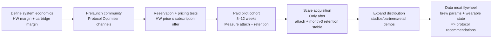

# Hardware + consumable/subscription benchmarks for Brezi

## Executive summary

Brezi’s “PrecisionBrew™ + cartridge subscription” sits squarely in a proven commercial archetype: **premium hardware as customer acquisition + recurring revenue as the profit engine**. The strongest public benchmarks show three repeatable truths:

Coffee “systems” monetise primarily through consumables. In entity["company","Keurig Dr Pepper","beverage company"]’s 2025 10‑K, **K‑Cup pods were US$3.213bn of U.S. Coffee’s US$3.990bn net sales (~80.5%)**, while appliances were US$582m (~14.6%), confirming the “pods drive the economics” structure. citeturn16view2turn23view1

Subscription-first wellness hardware wins on high-margin recurring revenue and low churn when the product is habit-forming. entity["company","Peloton Interactive","connected fitness company"] reports **Subscription gross margin 69.1%** in FY2025 and **Average Net Monthly Paid Connected Fitness Subscription churn 1.6%**—a strong retention floor for a premium lifestyle membership. citeturn6view0turn5view3

“Required subscription” models (rather than optional add-ons) can force attach but must deliver perceived value to avoid backlash. entity["company","Eight Sleep","sleep fitness hardware company"] states an **Autopilot plan is required for the first 12 months** and publishes tiered pricing (e.g., US$199/US$299/US$399 billed annually). citeturn10view0 That is effectively **100% attach in year one**, but it raises the bar on outcomes and support.

For Brezi, the practical implication is: **engineer a repeatable daily habit (morning brew) + ensure cartridges feel like “protocol packs” (outcomes-linked) rather than “refills” + prove subscription value quickly**. Wearables data suggests the market is already trained: **32% of wearable owners have an attached subscription**, and **92% of purchase intenders** say they’d pay extra for at least one health feature. citeturn22search0

## Benchmark models and unit economics

The table below compiles what is *publicly available* (filings, SEC documents, company pricing pages, and press releases). Where a metric is not publicly disclosed, it is marked **unspecified**. Where a figure is not audited, it is labelled **reported/estimate**.

| Company | Model | Attach rate (recurring) | ARPU / subscription price | Margin profile (hardware vs recurring) | LTV/CAC or unit-econ proxy | Source/year |
|---|---|---:|---:|---|---|
| entity["company","Nespresso","Nestle capsule coffee brand"] | Machines + capsules (system); premium DTC | Unspecified (consumable use is inherent; no “attach” disclosed) | Unspecified | Segment profitability disclosed, not HW vs capsule GM split: Sales CHF 6,481m; Underlying Trading Operating Profit CHF 1,160m (≈17.9% UTOP margin). | Unspecified | citeturn8view0 (2025) |
| Keurig (inside Keurig Dr Pepper) | Brewers + K‑Cup pods + partner brands | Consumables structurally required; revenue mix is a proxy | Unspecified | Company gross margin 54.2% (2025); U.S. Coffee operating margin 24.1% (segment, 2025). | Revenue mix proves “blades”: K‑Cup pods US$3.213bn of U.S. Coffee US$3.990bn net sales (~80.5%); appliances US$582m (~14.6%). | citeturn16view0turn16view2turn23view1 (FY2025) |
| entity["company","Oura","smart ring company"] | Ring + paid membership (most insights gated) | Unspecified (membership strongly encouraged; first month included) | US$5.99/mo or US$69.99/yr (US); UK £5.99/mo or £69.99/yr (pricing varies by country) | Unspecified | Scale proxy: >US$500m revenue (reported) and 5.5m rings sold (reported). | citeturn9search0turn9search12turn9search1 (pricing current; revenue 2024 reported) |
| entity["company","WHOOP","fitness wearable company"] | Membership includes device (subscription-first) | ~100% by definition (membership is the product) | US$239/yr (Peak) or US$359/yr (Life) tiers (US pricing; other markets vary) | Unspecified | Unspecified (private; revenue often reported/estimate outside primary filings) | citeturn9search2turn9search6 (pricing updated 2025) |
| Peloton | Equipment + subscription (All-Access / apps) | High for equipment owners; paid CF subs disclosed; device installed base not disclosed | All-Access pricing raised to US$49.99/mo from 1 Oct 2025 (US) (ARPU varies by mix) | FY2025: Subscription GM 69.1%; Connected Fitness Products gross profit US$111.2m on US$817.1m revenue (≈13.6% GM). | Churn: 1.6% avg net monthly paid CF churn (FY2025). Historical unit econ (IPO): LTV per subscriber US$3,593 (FY2019) and Net Customer Acquisition Cost (profit) US$5 per subscriber (FY2019) (definition provided in S‑1). | citeturn6view0turn5view3turn5view4turn18search2turn21view0 |
| entity["company","Therabody","recovery device company"] | Recovery hardware + accessories; some digital content | Not applicable (no core subscription disclosed) | N/A | Unspecified | Category signal: claims 71% US market share in its price range (NPD research cited by company). Revenue is not consistently published; media reports cite US$396m in 2021 (**reported**). | citeturn17search16turn17search0 |
| Eight Sleep | Sleep hardware + Autopilot membership (plus warranty tiers) | 100% in first 12 months (Autopilot required) | Standard US$199/yr (US$17/mo), Enhanced US$299/yr (US$25/mo), Elite US$399/yr (US$33/mo) | Unspecified | Lock-in mechanism: active membership tied to extended warranty and replacements (policy stated on product page). | citeturn10view0 (pricing + requirement current) |

Two benchmark nuances matter for Brezi’s design choices:

Keurig’s disclosure shows a **blades-heavy revenue mix** even when brewer unit volumes soften: in 2025, KDP reports U.S. Coffee appliance volume down 19.9% and K‑Cup pod volume down 4.8%, yet pods still dominate sales dollars. This is exactly the dynamic Brezi wants: hardware can be cyclical, but consumables smooth revenue. citeturn23view1turn16view2

Peloton’s filings demonstrate how meaningful the margin wedge is between hardware and recurring: subscription GM ~69% versus hardware GM in the teens. That wedge is why a Brezi cartridge subscription (if it retains) can fundamentally change the P&L profile. citeturn5view4

## Typical benchmark ranges and what to target

Because many private brands do not publish audited attach/ARPU/churn, “ranges” below are anchored to the best public datapoints above plus a large consumer survey for wearable subscription attachment.

### Attach rate patterns

A useful taxonomy is **optional recurring**, **structurally required recurring**, and **explicitly required subscription**:

Optional recurring often under-attaches unless value is obvious. In a survey of 8,000 US internet households, **32% of wearable owners** have an attached subscription. Treat this as a *baseline* for “optional add-on” behaviour in a mass market, not the ceiling for a Protocol Optimiser. citeturn22search0

Structurally required consumables behave like near‑100% attach in practice (you cannot keep using the system without buying the consumable). Keurig’s revenue mix implies this relationship at scale: pods account for ~80% of U.S. Coffee net sales. citeturn16view2turn23view1

Explicitly required subscription models can enforce attach at purchase. Eight Sleep states Autopilot is required for 12 months, turning attach into a default. citeturn10view0 WHOOP’s membership model similarly makes recurring revenue the primary commercial relationship. citeturn9search2

**Brezi target:** If cartridges are optional, **40% attach** is a reasonable “strong DTC hardware” ambition; if cartridges are presented as the default “Cold Protocol pack,” Brezi can aim for **60%+ attach**—but only if the perceived value is immediate and the friction is low. (These are recommended targets; not directly disclosed as an industry standard.)

### ARPU and price architecture

Public pricing shows the market’s tolerance band for “premium wellness subscriptions”:

Low-to-mid ARPU (wearables): Oura membership is **US$5.99/month** (varies by country; HKD/SGD/GBP pricing is published). citeturn9search0turn9search4

Mid ARPU (sleep optimisation): Eight Sleep memberships span **US$17–33 per month equivalent**. citeturn10view0

Higher ARPU (connected fitness): Peloton All‑Access moved from US$44 to **US$49.99/month** (US) effective Oct 2025. citeturn18search2

**Brezi implication:** a cartridge subscription that lands in the **US$20–35/month** zone will feel “normal” to the Protocol Optimiser *if* it is framed as a protocol pack (measured outcomes, state‑aware brewing, and convenience), not a commodity refill. Wearables data indicates willingness to pay for health features is widespread among buyers. citeturn22search0

### Gross margin and churn benchmarks

Public filings give unusually clean margin and churn anchors:

Peloton subscription gross margin: **69.1% (FY2025)** and contribution margin **73.0%**, showing recurring can carry software/media-like margins even in a hardware business. citeturn5view3turn5view4

Peloton paid connected fitness churn: **1.6% average net monthly** (FY2025). citeturn6view0 This implies roughly ~82% retention over 12 months as a simple approximation (1 − 0.016)^12 (illustrative calculation).

App-only churn is materially higher: Peloton’s Paid App Subscription churn is **7.0%** (FY2025), showing lower-commitment app subscriptions can churn quickly. citeturn6view0

Keurig Dr Pepper consolidated gross margin: **54.2% (FY2025)**—useful as an upper bound for blended system economics once consumables dominate. citeturn16view0

**Brezi target:** aim for **recurring gross margin ≥60%** once scaled, and design retention so that effective monthly churn is closer to “habit subscriptions” (1–3%) than “app-only” churn (~7%). The only way to earn that is: daily usage + clear value + reliable supply.

### LTV/CAC and payback patterns

Hard public LTV/CAC disclosure is rare, but Peloton’s IPO materials provide a concrete framework:

Peloton’s S‑1 explicitly defines **Net Customer Acquisition Cost (profit)** as adjusted sales & marketing expense minus adjusted connected fitness product gross profit, and reports that in FY2019 it equated to **US$5 per connected fitness subscriber added** (i.e., acquisition was almost paid back by hardware gross profit). citeturn21view0 The same S‑1 reports connected fitness subscriber lifetime value of **US$3,593 per subscriber** (FY2019), computed from subscription fee, churn, and contribution assumptions. citeturn21view2

**Brezi interpretation:** the gold standard is “hardware gross profit covers most acquisition cost” and the subscription then becomes highly profitable. For a US$300–400 device, this means (a) avoid deeply negative hardware margins at launch unless you have a clear plan and capital to subsidise, and (b) ensure subscription attach and retention are proven before you try to scale paid acquisition aggressively.

## 0→1 launch playbook for a US$300–400 hardware product

This is a practical, stepwise plan designed for a premium DTC wellness hardware launch with a cartridge subscription. It borrows principles from the benchmark cases: system economics (Keurig/Nespresso), subscription margin and churn discipline (Peloton), and required/locked features (Eight Sleep, WHOOP), while respecting the risk of subscription backlash if value is unclear.

### Stepwise plan

Define the economic “system” before product marketing  
Write down the two gross profit pools explicitly: (1) hardware gross profit, (2) cartridge gross profit. Keurig’s filings show why this matters: when pods are ~80% of segment net sales, the system can withstand appliance volatility. citeturn16view2turn23view1

Pick one subscription stance and design the product accordingly  
If cartridges are optional, you must over-deliver value to reach >40% attach. If they are “required for the full protocol,” you are in Eight Sleep territory (forced attach), which requires excellent onboarding, transparent pricing, and strong customer care. citeturn10view0

Build a prelaunch community around a measurable protocol, not a gadget  
The Protocol Optimiser buys systems that map to metrics. Use the same behavioural premise behind wearables subscriptions: consumers pay for “advanced coaching/health features” at scale. citeturn22search0 Your prelaunch content should teach: “how to run a Cold Protocol morning” (timing, caffeine strategy, cold exposure pairing, and what to measure).

Run pricing experiments before scaling acquisition  
A/B test (i) hardware price points (US$299/349/399), and (ii) cartridge subscription framing (“protocol packs” vs “refills”). Use deposits or refundable reservations to avoid noisy intent signals.

Pilot cohorts that explicitly measure retention and attach  
You need behavioural proof similar to Peloton’s retention focus: Peloton’s filings repeatedly tie low churn and high subscription gross margin to attractive LTV. citeturn6view0turn5view3 Your pilot should be designed to show whether PrecisionBrew becomes daily.

Scale channels in the order that preserves unit economics  
Start with founder-led content, partners, and high-intent communities; expand into paid social only once your subscription attach and month‑3 retention are stable. Peloton’s S‑1 shows how powerful it is when acquisition is largely “paid back” by product gross profit. citeturn21view0

### Recommended KPI targets for Brezi

These are recommended targets derived from the public benchmark environment; they are not universal standards:

Subscription attach at purchase: **40% (minimum viable)**, **60% (strong)**; if you force attach, **expect higher initial backlash** but higher immediate MRR.

Subscription retention: month‑12 retention **≥75%** (roughly consistent with 1–2% monthly churn behaviour; Peloton paid CF churn is 1.6% monthly). citeturn6view0

Gross margin: recurring GM **≥60%** (benchmark support: Peloton subscription GM ~69%). citeturn5view3

CAC payback: aim for **≤12 months** on blended gross profit; ideally **≤6 months** once systems economics stabilise. Peloton’s IPO framing is the precedent: “hardware gross profit offsets sales & marketing” enabling rapid payback. citeturn21view0

### Mermaid launch funnel

### 18‑month revenue model for a 10k-unit launch

This is a *worked example* to help you think in systems, not a forecast.

Assumptions (explicit):  
Hardware ASP = **US$399**; 10,000 units sold evenly over 12 months. Cartridge subscription price = **US$25/month**. Subscription churn = **2% monthly** (98% monthly retention). Subscription attaches at purchase at **20% / 40% / 60%**. Currency = USD.

Cumulative revenue at month 6 / 12 / 18:

| Month | Hardware revenue (cum) | Total revenue (20% attach) | Total revenue (40% attach) | Total revenue (60% attach) |
|---:|---:|---:|---:|---:|
| 6 | $1,995,000 | $2,080,000 | $2,165,000 | $2,249,000 |
| 12 | $3,990,000 | $4,292,000 | $4,594,000 | $4,897,000 |
| 18 | $3,990,000 | $4,543,000 | $5,096,000 | $5,650,000 |

18‑month totals and end-state MRR:

| Attach scenario | Subscription revenue (18m) | Total revenue (18m) | Active subs at month 18 | MRR at month 18 |
|---|---:|---:|---:|---:|
| 20% | $553,000 | $4,543,000 | 1,589 | $39,700 |
| 40% | $1,106,000 | $5,096,000 | 3,178 | $79,500 |
| 60% | $1,660,000 | $5,650,000 | 4,768 | $119,200 |

The key insight is that **attach rate dominates revenue quality**: hardware revenue is fixed by units, but recurring creates compounding cashflow and improves marketing tolerance. This is the same structural lesson shown in Keurig’s pod-heavy sales mix and Peloton’s subscription margin wedge. citeturn16view2turn5view3

## Risks and mitigations

Manufacturing and field failure risk  
Premium hardware brands lose trust quickly when returns spike. Mitigation: pilot with tightly controlled batch; instrument failure modes; over-invest in QA and packaging; maintain a spare-parts and swap policy consistent with a protocol brand.

Subscription value scepticism / “paywall backlash”  
Required subscriptions can trigger negative sentiment if seen as coercive. Mitigation: transparent pricing, clear feature map, and immediate value in week one; Eight Sleep’s model shows the hard-line “required for 12 months” approach—high attach, high expectations. citeturn10view0

Unit economics mismatch (hardware margin too low, attach too low)  
If hardware gross profit doesn’t offset CAC and attach is weak, paid growth becomes dangerous. Mitigation: treat paid acquisition as a privilege earned after pilots; Peloton’s IPO framing shows why rapid payback matters. citeturn21view0

Claims and regulatory exposure (health outcomes)  
Cold wellness and performance claims can drift into regulated territory. Mitigation: claims discipline; focus on measurable user-reported outcomes and non-medical language; use “protocol” framing rather than “treats/diagnoses.”

Data privacy and consent (wearable integrations)  
Biometric data increases risk. Mitigation: privacy-by-design, explicit opt-ins, minimal data retention, clear user controls, and separate “analytics” from “marketing” datasets.

Wearable integration fragility  
APIs change; integrations break; this can increase churn in a protocol product. Mitigation: design graceful degradation (core brew works without integrations) and treat integrations as additive.

Channel conflict and margin compression (retail vs DTC)  
Retail can accelerate volume but compress margin and complicate subscription capture. Mitigation: keep subscription capture DTC-first initially; if retail, include QR activation funnels and partner incentives for subscription activation (as a share of MRR).

Supply chain volatility for consumables  
Cartridges require consistent quality and SLAs. Mitigation: dual sourcing, conservative inventory buffers, and transparent substitution policies to protect the protocol promise.

## Assumptions and uncertainties

Many benchmarks do not publish attach rates or ARPU in audited form (especially private companies). Where attach/ARPU is not disclosed, this report uses either official pricing (ARPU proxy) or revenue mix (Keurig pods vs appliances) as the best available indicator. citeturn16view2turn10view0

Peloton metrics are unusually transparent because of SEC reporting; they may not generalise to smaller brands. The IPO-era unit economics (S‑1) used a US$39 monthly fee and low churn that differ from today’s pricing and market dynamics; it is included as a benchmarking “physics example” of how LTV/CAC can work in a hardware+subscription system. citeturn21view2turn21view0

The 18‑month model is illustrative and depends heavily on subscription price, attach, and churn; small changes in churn materially change MRR and lifetime revenue. The subscription churn assumption (2% monthly) is not a disclosed Brezi metric and must be validated via pilots.

Wearables subscription attachment (32%) is based on US internet household research and may vary by market and by Protocol Optimiser targeting; it is best treated as a baseline for “mass market” subscription behaviour, not the upper bound for a high-intent cohort. citeturn22search0